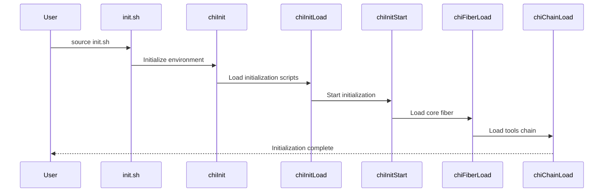

# Initialization

This document explains how Chitin handles initialization, with practical examples and clear explanations.

---

## Overview

1. Environment Setup:
   - Environment variable initialization
   - Path manipulation
   - Shell-specific settings

2. Module Loading:
   - Module discovery and loading
   - Dependency resolution
   - State tracking

3. Tool Management:
   - Tool verification and installation
   - Tool configuration loading
   - Tool dependency checking

4. Error Handling:
   - Error logging and recovery
   - Exit code management
   - Debug mode handling

---

## Key Scripts and Functions

Below is an overview of the relevant scripts and functions:

- init.sh  
  - `chiInit`: Initializes the environment
  - `chiInitLoad`: Loads initialization scripts
  - `chiInitStart`: Starts the initialization process

- chains/init/1-os.sh  
  - `chiOsDetect`: Detects the operating system
  - `chiOsGetName`: Gets the operating system name
  - `chiOsGetVersion`: Gets the operating system version

- chains/init/2-util-path.sh  
  - `chiPathAdd`: Adds a path to the PATH
  - `chiPathRemove`: Removes a path from the PATH
  - `chiPathGet`: Gets the current PATH

- chains/init/2-util-var.sh  
  - `chiVarSet`: Sets an environment variable
  - `chiVarGet`: Gets an environment variable
  - `chiVarUnset`: Unsets an environment variable

- chains/init/3-log.sh  
  - `chiLogError`: Logs error messages
  - `chiBail`: Handles fatal errors
  - `chiLogInfo`: Logs informational messages

---

## Common Usage Examples

### 1. Environment Setup

```bash
# Initialize the environment
chiInit

# Set up shell-specific settings
if [[ "$(chiMetaGetShell)" == "zsh" ]]; then
    setopt ksh_glob
    setopt shwordsplit
fi

# Add directories to PATH
chiPathAdd "/usr/local/bin"
chiPathAdd "$(chiVarGet "CHI_PROJECT_DIR")/bin"
```

### 2. Module Loading

```bash
# Load initialization scripts
chiInitLoad

# Start the initialization process
chiInitStart

# Load a specific module
chiFiberLoad "core"
chiChainLoad "core" "tools"
```

### 3. Tool Management

```bash
# Check if a tool is installed
if ! chiToolsCheck "git"; then
    chiLogError "Git is not installed" "core"
    chiBail "Please install Git and try again"
fi

# Load tool configurations
chiModuleLoadToolConfigs "core:tools"

# Check tool dependencies
if ! chiModuleCheckToolDepsMet "core:tools"; then
    chiLogError "Tool dependencies not met" "core:tools"
    return 1
fi
```

### 4. Error Handling

```bash
# Set error handling options
if [[ ! -z "$CHI_FAIL_ON_ERROR" ]]; then
    set -e
fi

# Log an error
chiLogError "Failed to load module" "core"

# Handle a fatal error
if ! chiToolsCheck "git"; then
    chiBail "Git is required but not installed"
fi

# Log information
chiLogInfo "Module loaded successfully" "core"
```

### 5. Initialization Sequence



---

## Implementation Patterns

1. Environment Setup:
   a. Use `chiOsDetect` to detect the OS
   b. Use `chiPathAdd` to modify the PATH
   c. Use `chiVarSet` to set environment variables

2. Module Loading:
   a. Use `chiInitLoad` to load initialization scripts
   b. Use `chiInitStart` to start the initialization process
   c. Use `chiInit` to initialize the environment

3. Tool Management:
   a. Use `chiToolsLoad` to load tools
   b. Use `chiToolsCheck` to check tools
   c. Use `chiToolsInstall` to install tools

4. Error Handling:
   a. Use `chiLogError` for non-fatal errors
   b. Use `chiBail` for fatal errors
   c. Use `chiLogInfo` for informational messages

---

## Common Pitfalls

1. Environment Setup:
   - Handle shell-specific features properly
   - Clean up environment variables
   - Manage PATH modifications carefully

2. Module Loading:
   - Handle circular dependencies
   - Check module compatibility
   - Clean up module resources

3. Tool Management:
   - Verify tool installations
   - Handle tool version mismatches
   - Clean up tool resources

4. Error Handling:
   - Use appropriate log levels
   - Handle errors gracefully
   - Clean up on error

---

## Considerations for TypeScript Port

1. Environment Setup:
   - Implement environment variable initialization
   - Handle path manipulation
   - Support shell-specific settings

2. Module Loading:
   - Implement module discovery and loading
   - Handle dependency resolution
   - Support state tracking

3. Tool Management:
   - Implement tool verification and installation
   - Handle tool configuration loading
   - Support tool dependency checking

4. Error Handling:
   - Implement error logging and recovery
   - Handle exit code management
   - Support debug mode handling

---

By understanding these initialization patterns and their practical usage, developers can effectively work with Chitin's initialization process and port it to TypeScript. The examples provided should help junior engineers understand how initialization is implemented in practice.
