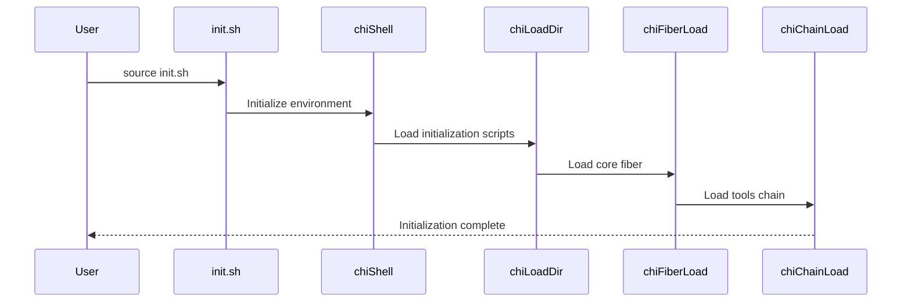

# Initialization

This document explains how Chitin handles initialization, with practical examples and clear explanations.

---

## Overview

1. Environment Setup:
   - Environment variable initialization
   - Path manipulation
   - Shell-specific settings

2. Module Loading:
   - Module discovery and loading
   - Dependency resolution
   - State tracking

3. Tool Management:
   - Tool verification and installation
   - Tool configuration loading
   - Tool dependency checking

4. Error Handling:
   - Error logging and recovery
   - Exit code management
   - Debug mode handling

---

## Key Scripts and Functions

Below is an overview of the relevant scripts and functions:

- init.sh  
  - `chiShell`: Main initialization function
  - `chiShellDebug`: Debug mode initialization
  - `chiLoadDir`: Loads script files from directories
  - `chiRunInitCommand`: Runs custom initialization commands from user config

- chains/init/1-os.sh  
  - `isMacOS`: Detects if running on macOS
  - Various OS-specific utility functions

- chains/init/2-util-path.sh  
  - `chiToolsAddDirToPath`: Adds a path to the PATH
  - `chiToolsRemoveDirFromPath`: Removes a path from the PATH
  - `chiExpandPath`: Expands path variables

- chains/init/2-util-var.sh  
  - `chiSetDynamicVariable`: Sets dynamic variables
  - `chiReadDynamicVariable`: Retrieves dynamic variables
  - `chiShowEnvvars`: Shows environment variables

- chains/init/3-log.sh  
  - `chiLogError`: Logs error messages
  - `chiBail`: Handles fatal errors
  - `chiLogInfo`: Logs informational messages

- chains/init/4-tools.sh
  - `chiToolsInstallTemporary`: Installs tools temporarily for bootstrap
  - `chiToolsInstallFromUrl`: Downloads and installs tools from URLs

- chains/init/5-json.sh
  - `chiJsonInitBootstrapDeps`: Initializes essential JSON tools if missing
  - Various JSON processing functions

---

## Common Usage Examples

### 1. Environment Setup

```bash
# Initialize the environment
chiShell

# Set up shell-specific settings
if [[ -z "$ZSH_VERSION" ]]; then
    shopt -s globstar
else
    setopt ksh_glob
    setopt shwordsplit
fi

# Add directories to PATH
chiToolsAddDirToPath "/usr/local/bin"
chiToolsAddDirToPath "$(chiExpandPath "~/bin")"
```

### 2. Module Loading

```bash
# Load script files from a directory
chiLoadDir $CHI_DIR/chains/init/**/*.sh

# Load a specific module
chiFiberLoad "$CHI_DIR"
chiChainLoad "core" "tools"

# Load external fibers (modules from other repos)
chiFiberLoadExternal
```

### 3. Tool Management

```bash
# Load tool configurations
chiModuleLoadToolConfigs "core:tools"

# Check tool dependencies
if ! chiModuleCheckToolDepsMet "core:tools"; then
    chiLogError "Tool dependencies not met" "core:tools"
    return 1
fi

# Update tool status
chiToolsUpdateStatus
```

### 4. Error Handling

```bash
# Set error handling options
if [[ ! -z "$CHI_FAIL_ON_ERROR" ]]; then
    set -e
fi

# Log an error
chiLogError "Failed to load module" "core"

# Handle a fatal error
if ! command -v git &> /dev/null; then
    chiBail "Git is required but not installed"
fi

# Log information
chiLogInfo "Module loaded successfully" "core"
```

### 5. Initialization Sequence



### 6. Bootstrap Process

Chitin includes a bootstrap process to ensure that essential tools are available:

```bash
# Check if jq is installed, install temporarily if not
if ! checkCommand jq; then
    chiLogInfo "dep 'jq' missing!" init json
    chiJsonInstallJqTemporary
fi

# Check if yq is installed, install temporarily if not
if ! checkCommand yq; then
    chiLogInfo "dep 'yq' missing!" init json
    chiJsonInstallYqTemporary
fi
```

The bootstrap process:
1. Checks for essential tools (jq, yq) needed for configuration processing
2. Temporarily installs missing tools to `$CHI_INIT_TEMP_DIR`
3. Adds the temporary tools to the PATH
4. Cleans up temporary tools after initialization completes

### 7. Custom Initialization Commands

Chitin allows users to specify custom commands to run during initialization:

```bash
# In userConfig.yaml
core:
  init:
    command: my-custom-setup-command
```

The `chiRunInitCommand` function reads this configuration and executes the specified command as part of the initialization process. This allows users to perform custom setup tasks without modifying Chitin's core code.

### 8. External Fiber Loading

Chitin can load modules from other repositories:

```bash
function chiFiberLoadExternal() {
    # Load fibers from dotfiles if configured
    if [[ -n "$CHI_DOTFILES_DIR" ]]; then
        chiFiberLoad "$CHI_DOTFILES_DIR"
    fi

    # Find and load all repositories with name 'chitin-*'
    IFS=$'\n' fibers=($(find "$CHI_PROJECT_DIR" -maxdepth 1 -type d -not -path "$CHI_PROJECT_DIR" -name 'chitin-*'))
    [[ ${#fibers[@]} -gt 0 ]] || return 0
    
    chiFiberLoadExternalLoop $*"${fibers[@]}"
}
```

This allows:
- Loading modules from your dotfiles repository
- Automatically discovering and loading modules from repositories with the `chitin-*` naming convention
- Handling dependencies between external modules

---

## Implementation Patterns

1. Environment Setup:
   a. Use `isMacOS` to detect if running on macOS
   b. Use `chiToolsAddDirToPath` to modify the PATH
   c. Use `chiSetDynamicVariable` to set environment variables

2. Module Loading:
   a. Use `chiLoadDir` to load script files
   b. Use `chiFiberLoad` to load fibers
   c. Use `chiChainLoad` to load chains

3. Tool Management:
   a. Use `chiModuleLoadToolConfigs` to load tool configs
   b. Use `chiModuleCheckToolDepsMet` to check tool dependencies
   c. Use `chiToolsUpdateStatus` to update tool status

4. Error Handling:
   a. Use `chiLogError` for non-fatal errors
   b. Use `chiBail` for fatal errors
   c. Use `chiLogInfo` for informational messages

---

## Common Pitfalls

1. Environment Setup:
   - Handle shell-specific features properly
   - Clean up environment variables
   - Manage PATH modifications carefully

2. Module Loading:
   - Handle circular dependencies
   - Check module compatibility
   - Clean up module resources

3. Tool Management:
   - Verify tool installations
   - Handle tool version mismatches
   - Clean up tool resources

4. Error Handling:
   - Use appropriate log levels
   - Handle errors gracefully
   - Clean up on error

---

## Considerations for TypeScript Port

1. Environment Setup:
   - Implement environment variable initialization
   - Handle path manipulation
   - Support shell-specific settings

2. Module Loading:
   - Implement module discovery and loading
   - Handle dependency resolution
   - Support state tracking

3. Tool Management:
   - Implement tool verification and installation
   - Handle tool configuration loading
   - Support tool dependency checking

4. Error Handling:
   - Implement error logging and recovery
   - Handle exit code management
   - Support debug mode handling

5. Bootstrap Process:
   - Implement equivalent functionality for installing essential tools
   - Create a mechanism for temporary tool installation
   - Properly clean up temporary resources

---

By understanding these initialization patterns and their practical usage, developers can effectively work with Chitin's initialization process and port it to TypeScript. The examples provided should help junior engineers understand how initialization is implemented in practice.
